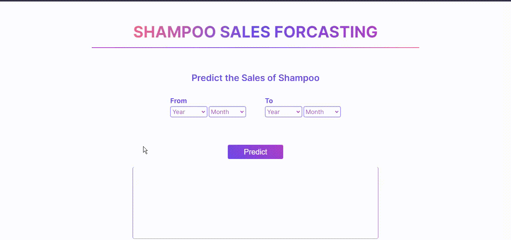

# Shampoo_Sales_Forecasting

Predicting the Sales of Shampoo for next years using time series analysis. Based on Three years of Monthly wise time series data, forcasting of sales has been implemented.

## Demo



## Tech Stack

- **Client:** HTML, CSS, JavaScript

- **Server:** Python with libraries scipy, scikit-learn, pandas, numpy

- **API Framework:** Python Flask==2.0.2

## Deployed Link

This project is deployed in the cloud service of Heroku

- App link : [Sales_forecasting](https://concrete-strength-prediction11.herokuapp.com/)

## Run App Locally

To run the App locally python version 3.6 or higher should be installed in your computer

Clone the project

Go to the project directory you want to clone the project files

```bash
  cd your-project-directory
```

```bash
git clone https://github.com/Vishnu-Nadh/Shampoo_Sales_Forecasting.git
```

Install dependencies

Choose your python environment to install dependencies and install the libaries using below commant in terminal

```bash
  pip install -r requirements.txt
```

Start the server.
You can either run main.py file or type the below command in terminal

```bash
    python app.py
```

Press Enter. The app will be running in localhost port number 5000 : http://localhost:5000/.

## Reflections

- 3 year data for sales is used for training. Data was in uncleaned format with date and Sales column combined and was improperly fomatted. After formatting and cleaning data check for stationarity is done.
- The data is non seasonal, non-stationary and with a upward trend. Defferenced one time to make data stationary.
- ARIMA model is used with Optimum values of parameters found using autocorrelation and partial autocorrelation graphs. Model performance is satisfactory.
- Prediction pipelines is implemented with preprocessing of input data.
- UI is created using HTML, CSS and javascript. Form validations (eg: Incorrect date format , empty inputs etc) are established. Entire interphase is done using ajax.

## 🚀 About Me

- 📈I'm a Data scientist...
- 🖥Full stack python developer..
- 💻Tech enthusiast..
- 📖Avid learner..

## 🔗 Links

[](https://www.linkedin.com/in/vishnunadh/)
